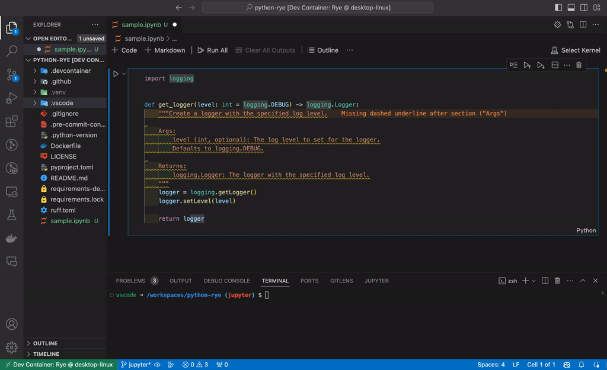

# Python Development with uv and Ruff

<div align="center">

[](https://github.com/astral-sh/uv)
[](https://github.com/astral-sh/ruff)
[](https://github.com/astral-sh/ty)

[](https://github.com/a5chin/python-uv)


[](https://github.com/a5chin/python-uv/actions/workflows/docker.yml)
[](https://github.com/a5chin/python-uv/actions/workflows/format.yml)
[](https://github.com/a5chin/python-uv/actions/workflows/lint.yml)
[](https://codecov.io/github/a5chin/python-uv)

</div>

A production-ready Python development environment template using modern tools: **uv** for blazing-fast package management, **Ruff** for lightning-fast linting and formatting, **ty** for fast and reliable type checking, and **VSCode Dev Containers** for reproducible development environments.

<div align="center">
 
</div>

---

## 📋 Table of Contents

- [Python Development with uv and Ruff](#python-development-with-uv-and-ruff)
  - [📋 Table of Contents](#-table-of-contents)
  - [✨ Features](#-features)
  - [🚀 Quick Start](#-quick-start)
    - [Using Dev Container (Recommended)](#using-dev-container-recommended)
    - [Using Docker Only](#using-docker-only)
    - [Local Setup (Without Docker)](#local-setup-without-docker)
  - [📚 Development Workflow](#-development-workflow)
    - [Installing Dependencies](#installing-dependencies)
    - [Running Tasks](#running-tasks)
    - [Pre-commit Hooks](#pre-commit-hooks)
    - [Documentation](#documentation)
  - [🏗️ Project Structure](#️-project-structure)
    - [Built-in Utility Modules](#built-in-utility-modules)
      - [**Logger** - Dual-mode logging system](#logger---dual-mode-logging-system)
      - [**Configuration** - Environment-based settings](#configuration---environment-based-settings)
      - [**Timer** - Performance monitoring](#timer---performance-monitoring)
  - [⚙️ Configuration](#️-configuration)
    - [Ruff Configuration](#ruff-configuration)
    - [ty Configuration](#ty-configuration)
    - [Pytest Configuration](#pytest-configuration)
  - [🔄 CI/CD](#-cicd)
  - [🎨 VSCode Configuration](#-vscode-configuration)
  - [🍪 Cookiecutter Templates](#-cookiecutter-templates)
  - [📖 Documentation](#-documentation)
  - [🌿 Branches](#-branches)
  - [📄 License](#-license)
  - [🙏 Acknowledgments](#-acknowledgments)

---

## ✨ Features

- 🚀 **Ultra-fast package management** with [uv](https://github.com/astral-sh/uv) (10-100x faster than pip)
- ⚡ **Lightning-fast linting & formatting** with [Ruff](https://github.com/astral-sh/ruff) (replacing Black, isort, Flake8, and more)
- 🐳 **Dev Container ready** - Consistent development environment across all machines
- 🔍 **Type checking** with ty
- ✅ **Pre-configured testing** with pytest (75% coverage requirement)
- 🔄 **Automated CI/CD** with GitHub Actions
- 📦 **Reusable utilities** - Logger, configuration management, and performance tracing tools
- 🎯 **Task automation** with nox
- 🪝 **Pre-commit hooks** for automatic code quality checks

## 🚀 Quick Start

### Using Dev Container (Recommended)

1. **Prerequisites**: Install [Docker](https://www.docker.com/) and [VSCode](https://code.visualstudio.com/) with the [Dev Containers extension](https://marketplace.visualstudio.com/items?itemName=ms-vscode-remote.remote-containers)

2. **Open in container**:
   ```bash
   git clone https://github.com/a5chin/python-uv.git
   cd python-uv
   code .
   ```
   When prompted, click "Reopen in Container"

3. **Start developing**:
   ```bash
   # Install dependencies
   uv sync

   # Run tests
   uv run nox -s test

   # Format and lint
   uv run nox -s fmt
   uv run nox -s lint -- --ruff --ty
   ```

### Using Docker Only

```bash
# Build the image
docker build -t python-uv .

# Run container
docker run -it --rm -v $(pwd):/workspace python-uv
```

### Local Setup (Without Docker)

**Prerequisites**: Python 3.11+ and [uv](https://github.com/astral-sh/uv)

```bash
# Install uv (if not already installed)
curl -LsSf https://astral.sh/uv/install.sh | sh

# Clone and setup
git clone https://github.com/a5chin/python-uv.git
cd python-uv

# Install dependencies
uv sync

# Install pre-commit hooks (optional)
uv run pre-commit install
```

## 📚 Development Workflow

### Installing Dependencies

```bash
# Install all dependencies (including dev dependencies)
uv sync

# Install without dev dependencies
uv sync --no-dev

# Add new dependencies
uv add requests pandas

# Add dev dependencies
uv add --dev pytest-mock
```

### Running Tasks

This project uses **nox** for task automation. All common development tasks are available as nox sessions:

```bash
# Format code with Ruff
uv run nox -s fmt

# Run linters (Ruff + ty)
uv run nox -s lint -- --ruff --ty

# Run only ty
uv run nox -s lint -- --ty

# Run only Ruff linter
uv run nox -s lint -- --ruff

# Run tests with coverage (75% minimum required)
uv run nox -s test

# Run tests with JUnit XML output (for CI)
uv run nox -s test -- --cov_report=xml
```

You can also run tools directly:

```bash
# Run pytest directly
uv run pytest

# Run specific test file
uv run pytest tests/tools/test__logger.py

# Format with Ruff
uv run ruff format .

# Lint with Ruff
uv run ruff check . --fix

# Type check with ty
uv run ty check
```

### Pre-commit Hooks

Pre-commit hooks automatically run code quality checks before each commit:

```bash
# Install hooks
uv run pre-commit install

# Run manually on all files
uv run pre-commit run --all-files
```

Configured hooks:
- Ruff formatting and linting
- JSON, YAML, TOML validation
- Trailing whitespace removal
- End-of-file fixer
- Private key detection
- Dockerfile linting with hadolint

### Documentation

Generate and serve documentation with MkDocs:

```bash
# Serve locally at http://127.0.0.1:8000
uv run mkdocs serve

# Build static site
uv run mkdocs build

# Deploy to GitHub Pages
uv run mkdocs gh-deploy
```

## 🏗️ Project Structure

```
.
├── tools/                  # Reusable utility modules
│   ├── config/             # Configuration management (Settings, FastAPI config)
│   ├── logger/             # Logging utilities (Local & Google Cloud formatters)
│   └── tracer/             # Performance tracing (Timer decorator/context manager)
├── tests/                  # Test suite (mirrors tools/ structure)
│   └── tools/              # Unit tests for utility modules
├── docs/                   # MkDocs documentation
│   ├── getting-started/    # Setup guides
│   ├── guides/             # Tool usage guides
│   ├── configurations/     # Configuration references
│   └── usecases/           # Real-world examples
├── .devcontainer/          # Dev Container configuration
├── .github/                # GitHub Actions workflows, PR templates, and review checklists
├── CODE_OF_CONDUCT.md      # Community Code of Conduct
├── CONTRIBUTING.md         # Contribution guidelines
├── CLAUDE.md               # Claude Code development guidance
├── noxfile.py              # Task automation configuration (test, lint, fmt)
├── pyproject.toml          # Project metadata and dependencies (uv)
├── ruff.toml               # Ruff linter/formatter configuration
└── pytest.ini              # Pytest configuration (75% coverage requirement)
```

### Built-in Utility Modules

The `tools/` package provides production-ready utilities that can be used in your projects:

#### **Logger** - Dual-mode logging system

Environment-aware logging with support for local development and cloud environments:

```python
from tools.logger import Logger, LogType

# Local development (colored console output)
logger = Logger(__name__, log_type=LogType.LOCAL)

# Google Cloud (structured JSON logging)
logger = Logger(__name__, log_type=LogType.GOOGLE_CLOUD, project="my-project")

logger.info("Application started")
```

#### **Configuration** - Environment-based settings

Type-safe configuration management using Pydantic:

```python
from tools.config import Settings

settings = Settings()  # Loads from .env and .env.local
api_url = settings.api_prefix_v1
is_debug = settings.DEBUG
```

#### **Timer** - Performance monitoring

Automatic execution time logging for functions and code blocks:

```python
from tools.tracer import Timer

# As context manager
with Timer("database_query"):
    result = db.query()  # Logs execution time automatically

# As decorator
@Timer("process_data")
def process_data(data):
    return transform(data)  # Logs execution time when function completes
```

## ⚙️ Configuration

### Ruff Configuration

Ruff replaces multiple tools (Black, isort, Flake8, pydocstyle, pyupgrade, autoflake) with a single, fast tool.

**Key settings in `ruff.toml`:**
- **Line length**: 88 (Black-compatible)
- **Target Python**: 3.14
- **Rules**: ALL enabled by default with specific exclusions
- **Test files**: Exempt from `INP001` (namespace packages) and `S101` (assert usage)

> See [Ruff documentation](https://docs.astral.sh/ruff/) for customization options.

### ty Configuration

Static type checking for Python code.

**Key settings in `ty.toml`:**
- **Include**: `tools/` and `tests/` packages
- **Exclude**: Cache directories (`__pycache__`, `.pytest_cache`, `.ruff_cache`, `.venv`)

> See [ty documentation](https://github.com/astral-sh/ty) for advanced configuration.

### Pytest Configuration

Testing framework with coverage enforcement.

**Key settings in `pytest.ini`:**
- **Coverage requirement**: 75% minimum (including branch coverage)
- **Test file pattern**: `test__*.py` (double underscore)
- **Coverage reports**: HTML and terminal
- **Import mode**: importlib

> See [pytest documentation](https://docs.pytest.org/) for additional options.

## 🔄 CI/CD

Automated workflows ensure code quality and consistency. All workflows run on push and pull requests.

**Available workflows in `.github/workflows/`:**

| Workflow                   | Purpose                              | Tools Used       |
| -------------------------- | ------------------------------------ | ---------------- |
| `docker.yml`               | Validate Docker build                | Docker           |
| `devcontainer.yml`         | Validate Dev Container configuration | devcontainer CLI |
| `format.yml`               | Check code formatting                | Ruff             |
| `labeler.yml`              | Add label in GitHub                  | GitHub           |
| `lint.yml`                 | Run static analysis                  | Ruff, ty         |
| `test.yml`                 | Run test suite with coverage         | pytest, coverage |
| `gh-deploy.yml`            | Deploy documentation to GitHub Pages | MkDocs           |
| `pr-agent.yml`             | Automated PR reviews                 | Qodo AI PR Agent |
| `publish-devcontainer.yml` | Publish Dev Container image          | Docker, GHCR     |

## 🎨 VSCode Configuration

The Dev Container includes pre-configured extensions and settings for optimal Python development.

**Python Development:**
- **Ruff** - Fast linting and formatting
- **ty** - Static type checking
- **Python** - Core Python support
- **autodocstring** - Automatic docstring generation
- **python-indent** - Correct Python indentation

**Code Quality:**
- **GitLens** - Enhanced Git integration
- **Error Lens** - Inline error highlighting
- **indent-rainbow** - Visual indentation guide
- **trailing-spaces** - Highlight trailing whitespace

**File Support:**
- **YAML**, **TOML**, **Markdown** - Configuration file support
- **Docker** - Dockerfile and docker-compose support
- **Material Icon Theme** - File icons

**Editor Settings:**
- ✅ Format on save (Python, JSON, YAML, TOML, Dockerfile)
- ✅ Auto-trim trailing whitespace
- ✅ Auto-insert final newline
- ✅ Organize imports on save

> **Troubleshooting**: If Ruff formatting doesn't work, reload the window: `Cmd+Shift+P` → "Developer: Reload Window"

## 🍪 Cookiecutter Templates

This repository can be used as a base template for various Python projects. Combine it with Cookiecutter to bootstrap project-specific setups:

```bash
# Install cookiecutter
uv add --dev cookiecutter

# Use a template
uv run cookiecutter <template-url>
```

**Recommended templates:**

- **Data Science**: [cookiecutter-data-science](https://github.com/drivendataorg/cookiecutter-data-science) - Standardized data science project structure
- **FastAPI**: [full-stack-fastapi-template](https://github.com/fastapi/full-stack-fastapi-template) - Full-stack web applications
- **Django**: [cookiecutter-django](https://github.com/cookiecutter/cookiecutter-django) - Production-ready Django projects
- **Flask**: [cookiecutter-flask](https://github.com/cookiecutter-flask/cookiecutter-flask) - Flask web applications

## 📖 Documentation

Comprehensive documentation is available at **[https://a5chin.github.io/python-uv](https://a5chin.github.io/python-uv)**

**Topics covered:**
- 🚀 **Getting Started** - Docker, VSCode, Dev Containers setup
- ⚙️ **Tool Configurations** - uv, Ruff, ty, pre-commit
- 🧪 **Testing Strategies** - pytest, coverage, and best practices
- 🛠️ **Utility Modules** - Config, logger, and tracer guides
- 💡 **Use Cases** - Jupyter, FastAPI, OpenCV examples

## 🌿 Branches

This repository maintains multiple branches for different use cases:

- **[main](https://github.com/a5chin/python-uv/tree/main)** - Current production-ready template (recommended)
- **[jupyter](https://github.com/a5chin/python-uv/tree/jupyter)** - Archived: Jupyter-specific configuration
- **[rye](https://github.com/a5chin/python-uv/tree/rye)** - Archived: Rye package manager version (replaced by uv)

## 📄 License

This project is licensed under the MIT License - see the [LICENSE](LICENSE) file for details.

## 🙏 Acknowledgments

This template is built on top of excellent open-source tools:

- **[uv](https://github.com/astral-sh/uv)** by Astral - Ultra-fast Python package manager
- **[Ruff](https://github.com/astral-sh/ruff)** by Astral - Lightning-fast linter and formatter
- **[ty](https://github.com/astral-sh/ty)** by Astral - Static type checker for Python
- **[nox](https://nox.thea.codes/)** - Flexible task automation for Python
- **[pytest](https://pytest.org/)** - Testing framework for Python
- **[MkDocs](https://www.mkdocs.org/)** - Documentation site generator

Special thanks to the open-source community for making these tools available!
