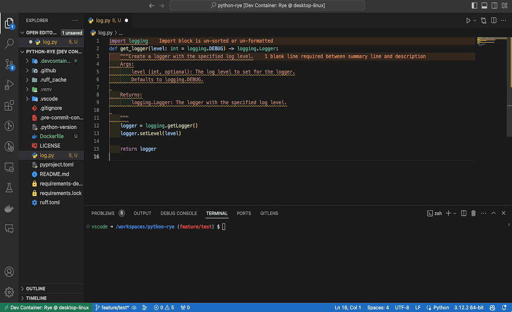
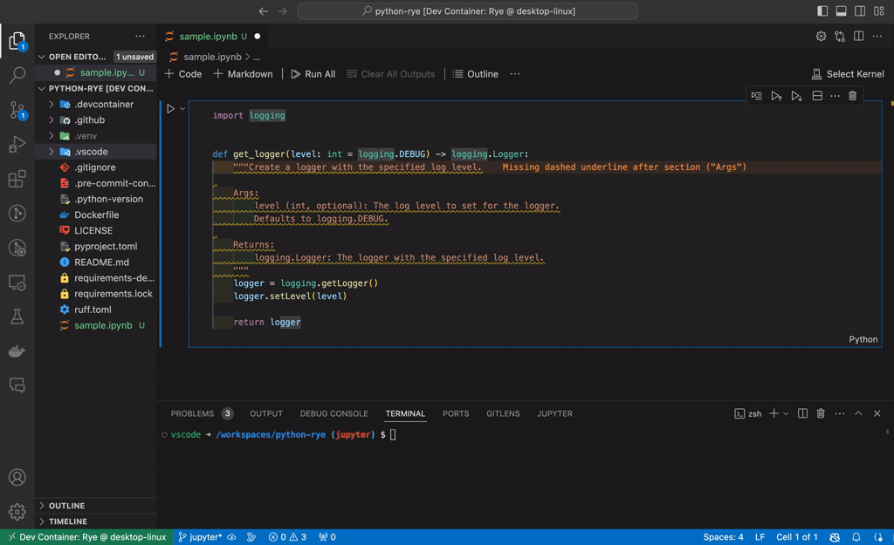

# Python Development with uv and Ruff

<div align="center">

[](https://github.com/astral-sh/uv)
[](https://github.com/astral-sh/ruff)
[](https://github.com/astral-sh/ty)

[](https://github.com/a5chin/python-uv)
[](https://codecov.io/github/a5chin/python-uv)

[](https://github.com/a5chin/python-uv/actions/workflows/docker.yml)
[](https://github.com/a5chin/python-uv/actions/workflows/format.yml)
[](https://github.com/a5chin/python-uv/actions/workflows/lint.yml)

</div>

A production-ready Python development environment template using modern tools: **uv** for blazing-fast package management, **Ruff** for lightning-fast linting and formatting, **ty** for fast and reliable type checking, and **VSCode Dev Containers** for reproducible development environments.

<div align="center">
 
</div>

---

## 📋 Table of Contents

- [Python Development with uv and Ruff](#python-development-with-uv-and-ruff)
  - [📋 Table of Contents](#-table-of-contents)
  - [✨ Features](#-features)
  - [🚀 Quick Start](#-quick-start)
  - [📖 Documentation](#-documentation)
  - [🗄️ Archived Branches](#️-archived-branches)
  - [📄 License](#-license)
  - [🙏 Acknowledgments](#-acknowledgments)

---

## ✨ Features

- 🚀 **Ultra-fast package management** with [uv](https://github.com/astral-sh/uv) (10-100x faster than pip)
- ⚡ **Lightning-fast linting & formatting** with [Ruff](https://github.com/astral-sh/ruff) (replacing Black, isort, Flake8, and more)
- 🐳 **Dev Container ready** - Consistent development environment across all machines
- 🔍 **Type checking** with ty
- ✅ **Pre-configured testing** with pytest (75% coverage requirement)
- 🔄 **Automated CI/CD** with GitHub Actions
- 📦 **Reusable utilities** - Logger, configuration management, and performance tracing tools
- 🎯 **Task automation** with nox
- 🪝 **Pre-commit hooks** for automatic code quality checks

## 🚀 Quick Start

1. Install [Docker](https://www.docker.com/) and [VSCode](https://code.visualstudio.com/) with the [Dev Containers extension](https://marketplace.visualstudio.com/items?itemName=ms-vscode-remote.remote-containers).
2. Clone the repository and open it in VSCode, then click **Reopen in Container** when prompted:
   ```bash
   git clone https://github.com/a5chin/python-uv.git
   cd python-uv
   code .
   ```
3. Check that everything works:
   ```bash
   uv run nox -s test
   ```

For Docker-only or local setup (without Docker), see [Getting Started](docs/getting-started/index.md).

## 📖 Documentation

The full documentation is published at **[https://a5chin.github.io/python-uv](https://a5chin.github.io/python-uv)**. Its source lives in [`docs/`](docs/index.md), which is the single source of truth for every topic below.

| Topic | Document |
|---|---|
| Setup (Dev Container, Docker, local) | [Getting Started](docs/getting-started/index.md) |
| Development commands (`fmt` / `lint` / `test`) | [Task Automation with nox](docs/guides/index.md#task-automation-with-nox) |
| uv, Ruff, ty, pre-commit, pytest | [Guides](docs/guides/index.md) |
| Configuration files | [Configuration Reference](docs/configurations/index.md) |
| Built-in utilities (`Logger`, `Settings`, `Timer`) | [Tools Package](docs/guides/tools/index.md) |
| Coding rules and writing tests | [Code Standards](docs/guides/code-standards.md) |
| Branches, releases, and deployment | [Branch Strategy & Release Flow](docs/guides/branch-strategy.md) |
| GitHub Actions workflows | [CI/CD Workflows](docs/guides/ci-cd.md) |
| Project templates | [cookiecutter](docs/guides/cookiecutter.md) |
| Examples (Jupyter, FastAPI, OpenCV) | [Use Cases](docs/usecases/index.md) |

To contribute, see [CONTRIBUTING.md](CONTRIBUTING.md).

## 🗄️ Archived Branches

These branches are no longer maintained; use `main` for new projects.

- **[jupyter](https://github.com/a5chin/python-uv/tree/jupyter)** - Jupyter-specific configuration
- **[rye](https://github.com/a5chin/python-uv/tree/rye)** - Rye package manager version (replaced by uv)

## 📄 License

This project is licensed under the MIT License - see the [LICENSE](LICENSE) file for details.

## 🙏 Acknowledgments

This template is built on top of excellent open-source tools:

- **[uv](https://github.com/astral-sh/uv)** by Astral - Ultra-fast Python package manager
- **[Ruff](https://github.com/astral-sh/ruff)** by Astral - Lightning-fast linter and formatter
- **[ty](https://github.com/astral-sh/ty)** by Astral - Static type checker for Python
- **[nox](https://nox.thea.codes/)** - Flexible task automation for Python
- **[pytest](https://pytest.org/)** - Testing framework for Python
- **[MkDocs](https://www.mkdocs.org/)** - Documentation site generator

Special thanks to the open-source community for making these tools available!
