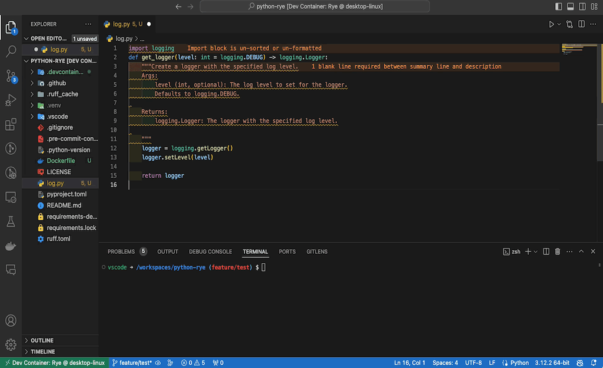

# VSCode Dev Container: Python Development with uv and Ruff

<div align="center">

[](https://github.com/astral-sh/uv)
[](https://github.com/astral-sh/ruff)

[](https://github.com/a5chin/python-uv)


[](https://github.com/a5chin/python-uv/actions/workflows/docker.yml)
[](https://github.com/a5chin/python-uv/actions/workflows/format.yml)
[](https://github.com/a5chin/python-uv/actions/workflows/lint.yml)
[](https://github.com/a5chin/python-uv/actions/workflows/test.yml)

</div>

## Overview
This repository contains configurations to set up a Python development environment using VSCode's Dev Container feature.
The environment includes uv, and Ruff.



If the Ruff format does not work, try reloading the VS Code window.
Specifically, you can solve this problem by following the steps below.

1. Type `⌘+⇧+P` to open the command palette
2. Type `Developer: Reload Window` in the command palette to reload the window

### Contents
- [VSCode Dev Container: Python Development with uv and Ruff](#vscode-dev-container-python-development-with-uv-and-ruff)
  - [Overview](#overview)
    - [Contents](#contents)
  - [Branches](#branches)
  - [Settings](#settings)
  - [Dev Container](#dev-container)
  - [GitHub Actions](#github-actions)
  - [Ruff](#ruff)
  - [pre-commit](#pre-commit)
  - [pytest](#pytest)
  - [cookiecutter](#cookiecutter)
  - [Appendix](#appendix)
    - [Install libraries](#install-libraries)
    - [The structure of this repository](#the-structure-of-this-repository)

## Branches
- [main](https://github.com/a5chin/python-uv/tree/main)
- [jupyter](https://github.com/a5chin/python-uv/tree/jupyter)
- [rye](https://github.com/a5chin/python-uv/tree/rye)（Archived）

## Settings
- files.insertFinalNewline
- files.trimTrailingWhitespace
- editor.formatOnSave
  - dockercompose
  - dockerfile
  - github-actions-workflow
  - json, jsonc
  - python
  - toml
  - yaml

## Dev Container
- `devcontainer.json`
  - features
    - hadolint
  - extentions
    - [charliermarsh.ruff](https://marketplace.visualstudio.com/items?itemName=charliermarsh.ruff)
    - [codezombiech.gitignore](https://marketplace.visualstudio.com/items?itemName=codezombiech.gitignore)
    - [eamodio.gitlens](https://marketplace.visualstudio.com/items?itemName=eamodio.gitlens)
    - [kevinrose.vsc-python-indent](https://marketplace.visualstudio.com/items?itemName=kevinrose.vsc-python-indent)
    - [mosapride.zenkaku](https://marketplace.visualstudio.com/items?itemName=mosapride.zenkaku)
    - [ms-azuretools.vscode-docker](https://marketplace.visualstudio.com/items?itemName=ms-azuretools.vscode-docker)
    - [ms-python.python](https://marketplace.visualstudio.com/items?itemName=ms-python.python)
    - [njpwerner.autodocstring](https://marketplace.visualstudio.com/items?itemName=njpwerner.autodocstring)
    - [oderwat.indent-rainbow](https://marketplace.visualstudio.com/items?itemName=oderwat.indent-rainbow)
    - [pkief.material-icon-theme](https://marketplace.visualstudio.com/items?itemName=pkief.material-icon-theme)
    - [redhat.vscode-yaml](https://marketplace.visualstudio.com/items?itemName=redhat.vscode-yaml)
    - [shardulm94.trailing-spaces](https://marketplace.visualstudio.com/items?itemName=shardulm94.trailing-spaces)
    - [tamasfe.even-better-toml](https://marketplace.visualstudio.com/items?itemName=tamasfe.even-better-toml)
    - [usernamehw.errorlens](https://marketplace.visualstudio.com/items?itemName=usernamehw.errorlens)
    - [yzhang.markdown-all-in-one](https://marketplace.visualstudio.com/items?itemName=yzhang.markdown-all-in-one)
- `Dockerfile`
  - Only Dev dependencies
    - `pre-commit`
    - `pyright`
    - `pytest`
    - `ruff`
- `buildWithRust.Dockerfile`
  - Use the Rust compiler when you need it!
  - Fix dockerfile in `.devcontainer/devcontainer.json`

## GitHub Actions
- `docker.yml`
  - Workflow to check if you can build with Docker
- `pyright.yml`
  - Workflow to check type
- `test.yml`
  - Workflow to check if all the described tests can be passed with pytest
- `ruff.yml`
  - Workflow to check if you can go through Formatter and Linter with Ruff

## Ruff
Ruff can be used to replace Flake8, Black, isort, pydocstyle, pyupgrade, autoflake, etc., and yet run tens to hundreds of times faster than the individual tools.

To change the configuration, it is necessary to rewrite ruff.toml, and [it is recommended](https://docs.astral.sh/ruff/formatter/#conflicting-lint-rules) to set it to ignore conflicts such as the following:
```toml
ignore = [
    "COM812", "COM819",
    "D100", "D203", "D213", "D300",
    "E111", "E114", "E117",
    "ISC001", "ISC002",
    "Q000", "Q001", "Q002", "Q003",
    "W191",
]
```

## pre-commit
The `.pre-commit-config.yaml` file can contain scripts to be executed before commit.

```sh
# Python Formatter
uv run ruff format .

# Python Linter
uv run ruff check . --fix

# Docker Linter
hodolint Dockerfile
```

## pytest
To run the test, use the following command:
```sh
uv run pytest
```

## cookiecutter
To use cookiecutter for template, use the following command:
```sh
uv run cookiecutter {url}
```
- Data Science
  - https://github.com/drivendataorg/cookiecutter-data-science
- Django
  - https://github.com/cookiecutter/cookiecutter-django
  - https://github.com/agconti/cookiecutter-django-rest
  - https://github.com/vchaptsev/cookiecutter-django-vue
  - https://github.com/chrisdev/wagtail-cookiecutter-foundation
  - https://github.com/wemake-services/wemake-django-template
- FastAPI
  - https://github.com/fastapi/full-stack-fastapi-template
- Flask
  - https://github.com/cookiecutter-flask/cookiecutter-flask
  - https://github.com/karec/cookiecutter-flask-restful
  - https://github.com/italomaia/flask-empty

## Appendix

### Install libraries
```sh
# Install also include develop dependencies
uv sync

# If you do not want dev dependencies to be installed
uv sync --no-dev

# Use the add command to add dependencies to your project
uv add {libraries}
```

### The structure of this repository
```
.
├── .devcontainer/
│   ├── devcontainer.json
│   └── Dockerfile
├── .github/
│   ├── actions/
│   │   ├── setup-git-config
│   │   │   └── action.yml
│   │   └── setup-python-with-uv
│   │       └── action.yml
│   ├── workflows/
│   │   ├── docker.yml
│   │   ├── pyright.yml
│   │   ├── ruff.yml
│   │   └── test.yml
│   └── dependabot.yml
├── .vscode
│   ├── extensions.json
│   └── settings.json
├── tests/
│   └── tools/
│        ├── test__config.py
│        ├── test__logger.py
│        └── test__tracer.py
├── tools/
│   ├── config/
│   │    ├── __init__.py
│   │    ├── fastapi.py
│   │    └── settings.py
│   ├── logger/
│   │    ├── __init__.py
│   │    ├── color.py
│   │    ├── googlecloud.py
│   │    ├── local.py
│   │    ├── logger.py
│   │    ├── style.py
│   │    └── type.py
│   ├── tracer/
│   │    ├── __init__.py
│   │    └── timer.py
│   └── __init__.py
├── .dockerignore
├── .env.local
├── .gitignore
├── .pre-commit-config.yaml
├── .python-version
├── Dockerfile
├── pyproject.toml
├── pyrightconfig.json
├── pytest.ini
├── README.md
├── ruff.toml
└── uv.lock
```
