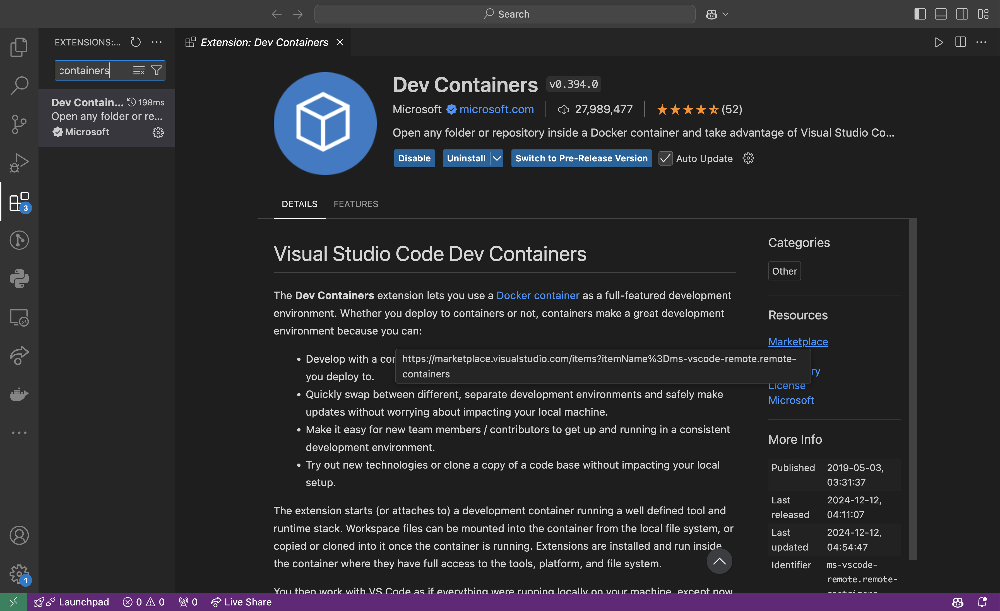

Install Dev Container, a VS Code extension, on VS Code.
Type ++command+shift+x++ on VS Code to open Extensions on the side, then type [`ms-vscode-remote.remote-containers`](https://marketplace.visualstudio.com/items?itemName=ms-vscode-remote.remote-containers) and install the extension that comes up.

{ loading=lazy }
/// caption
Dev Container features on VS Code
///
