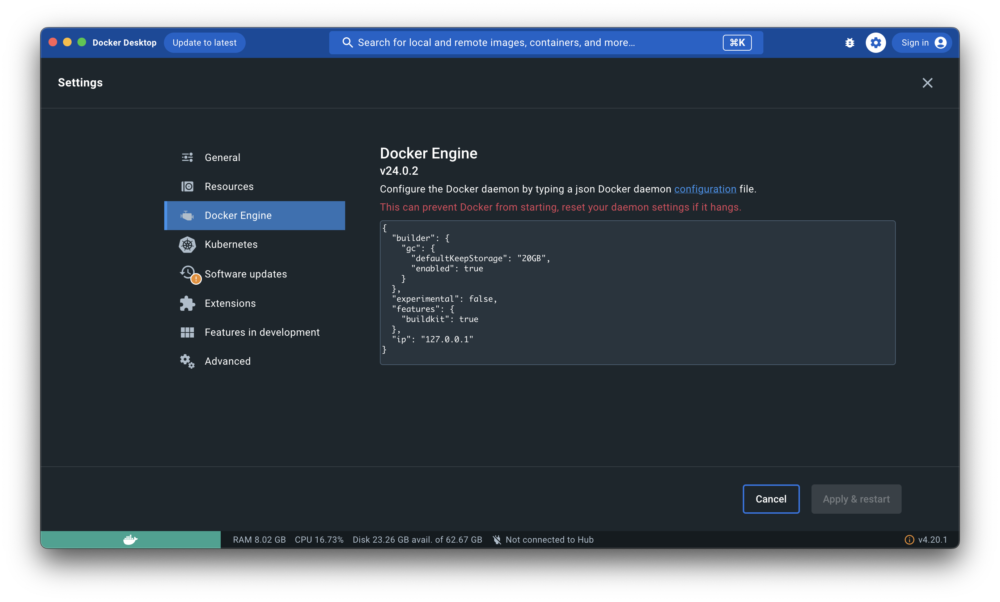

Install Docker from the [official Docker website](https://docker.com/products/docker-desktop).

!!! WARNING
    Publishing container ports is insecure by default. Meaning, when you publish a container’s ports it becomes available not only to the Docker host, but to the outside world as well.

    If you include the localhost IP address (127.0.0.1) with the publish flag, only the Docker host can access the published container port.

```json
{
    "builder": {
        "gc": {
        "defaultKeepStorage": "20GB",
        "enabled": true
        }
    },
    "experimental": false,
    "features": {
        "buildkit": true
    },
    "ip": "127.0.0.1"
}
```

{ loading=lazy }
/// caption
Docker App on Mac
///
