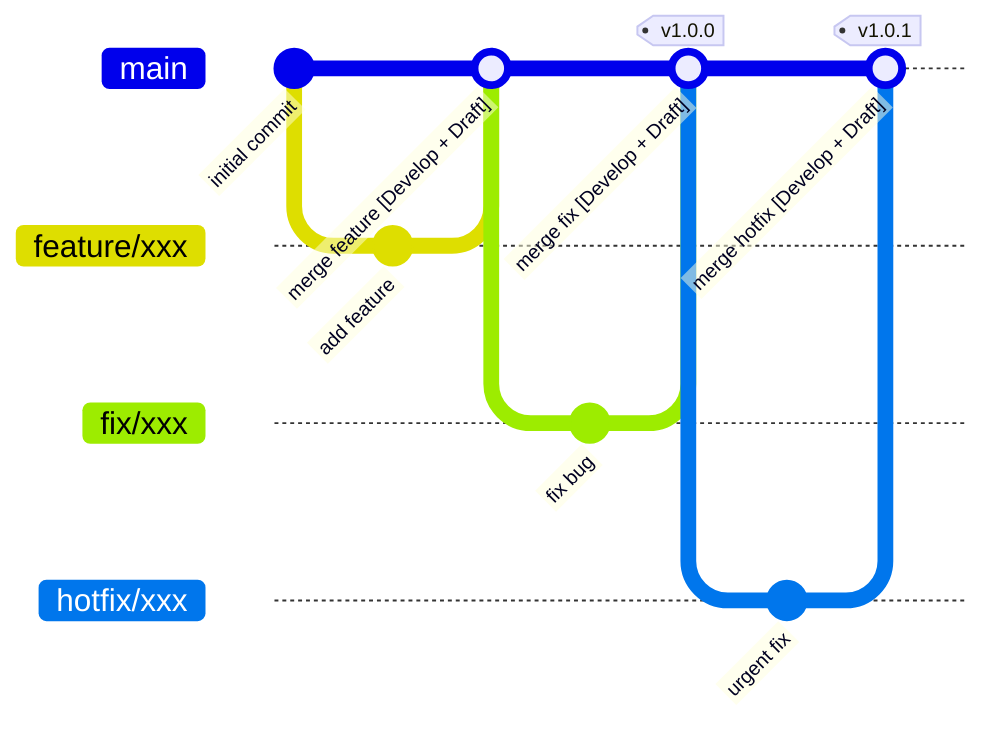

# Branch Strategy & Release Flow

This repository follows **GitHub Flow**: `main` is the only long-lived branch. There is no `develop` branch.

**Develop** and **Production** are GitHub Environments, not branches. "Deploying" to them means pushing the `app` and `devcontainer` container images to GHCR (`ghcr.io/a5chin/python-uv/{app,devcontainer}`).

- **[Develop + Draft]**: every merge into `main` pushes the images to Develop and, if the builds succeed, updates the Draft Release.
- **Tags (`v1.0.0`, `v1.0.1`)**: publishing the Draft adds the tag to the commit it points to and deploys that tag to Production. No commit is made for the tag; check the Develop images before publishing.

## Branches

Create every branch from `main` and merge it back into `main` with a pull request. Never push directly to `main`.

| Prefix | Use | Label added automatically |
|---|---|---|
| `feature/` | New features | `feature` |
| `fix/` | Bug fixes | `fix` |
| `hotfix/` | Urgent fix for a problem in Production | `hotfix` |
| `refactor/` | Refactoring | `refactor` |

Labels are added by [`labeler.yml`](https://github.com/a5chin/python-uv/blob/main/.github/labeler.yml) from the branch prefix; PRs that change `*.md` files also get `documentation`. These labels decide the section of the release notes.

## 1. Merge into `main` → Develop

Every merge into `main` runs [`release.yml`](https://github.com/a5chin/python-uv/blob/main/.github/workflows/release.yml):

1. The `publish` job builds the `app` and `devcontainer` images and pushes them to GHCR with the tags `main` and `sha-<full commit SHA>` (environment: **Develop**).
2. Only if **both** builds succeed, the `draft` job updates the Draft Release with release-drafter. The Draft points to the exact commit that was just built.

If several PRs are merged in quick succession, older runs are cancelled and only the latest commit is built and drafted.

## 2. Review the Draft Release → Publish → Production

Publishing is done by a **maintainer with write access** to the repository. Contributors only need to get their PR merged into `main`.

1. Open **Releases** on GitHub and edit the existing Draft. Do **not** create a new release or push a tag yourself.
2. Check the tag. release-drafter proposes it from the version labels on the merged PRs (`major` / `minor` / `patch`; the highest wins, default `patch`). Maintainers add version labels manually. You may change the tag; change it right before publishing, because any merge into `main` in between makes release-drafter overwrite it with its proposed value.
3. Edit the release notes if needed, then click **Publish release**. Publishing from the GitHub UI or with `gh release edit <tag> --draft=false` (your own credentials) is fine. Only releases published from inside a GitHub Actions workflow with `GITHUB_TOKEN` fail to trigger the deployment.
4. The `publish` job runs again (environment: **Production**), rebuilds the images from the tag, and pushes them with the tags `<release tag>` (e.g. `v1.3.0`) and `latest`. The `org.opencontainers.image.version` label is set to the release tag.

!!! WARNING
    The tag **must start with `v`** (e.g. `v1.3.0`). The Production environment only allows deployments from tags matching `v*` (a tag policy; no `v*` branch is created), so any other tag is rejected.

Pre-releases are **not** deployed: only a full release (or converting a pre-release to a full release) triggers Production.

## Hotfixes

Hotfixes follow the same flow: create `hotfix/*` from `main`, open a PR to `main`, merge, then publish the Draft.

Note that **everything already merged into `main` but not yet released ships together with the hotfix**. Check the Draft's change list before publishing.

- If some of those changes must not ship yet, revert them with a PR to `main` first, then publish.
- The proposed tag follows the PR labels (the highest of `major` / `minor` / `patch` wins), so it may be a minor version even for a hotfix. Change it if it does not match what you are releasing (e.g. `v1.2.4` for a patch); it must still start with `v`.

## When Something Fails

| Symptom | Cause | Action |
|---|---|---|
| The Draft Release was not updated after a merge | The `publish` job (image build) failed, so `draft` was skipped | Open the `Release` workflow run in the Actions tab, fix the failure, then re-run the failed jobs or merge the fix into `main` |
| Production succeeded for only one image | Image builds run independently (`fail-fast: false`) | Re-run the failed job in the same workflow run |
| Production deployment was rejected | The tag does not start with `v` | Edit the release, set it back to a draft, change the tag to start with `v`, and publish again |
