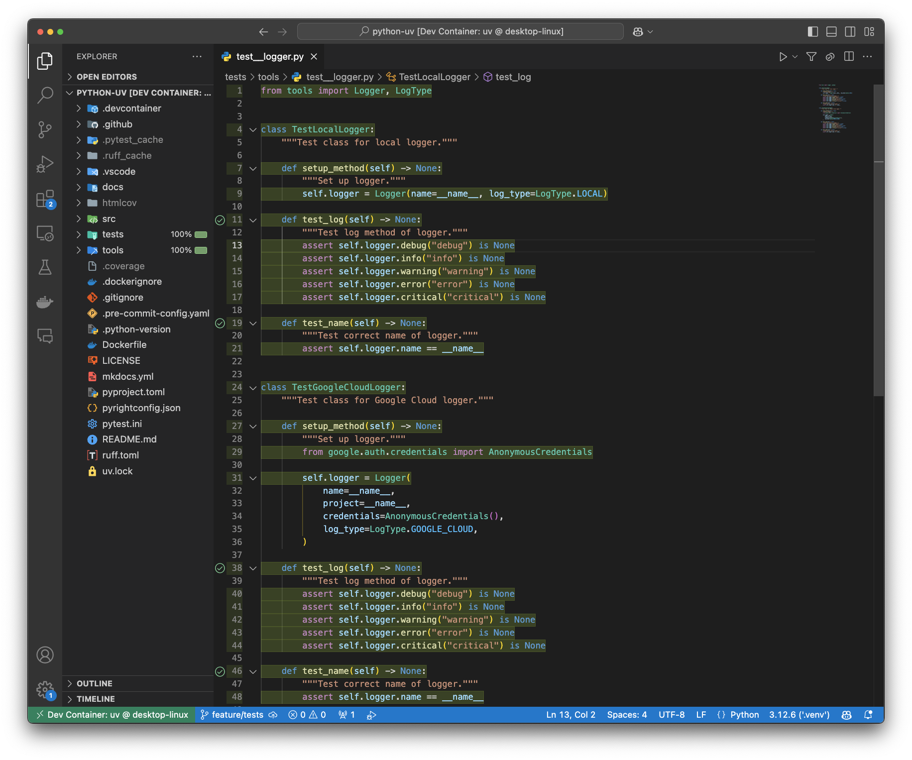

# Test User Guides on this repository

!!! TIP
    Official documentation for pytest is available at [https://docs.pytest.org/en/stable](https://docs.pytest.org/en/stable)

## Run pytest command
```sh
uv run pytest
```

```sh
============================================= test session starts =============================================
platform linux -- Python 3.12.6, pytest-8.3.4, pluggy-1.5.0
rootdir: /workspaces/python-uv
configfile: pytest.ini
testpaths: tests
plugins: cov-6.0.0
collected 4 items

tests/tools/test__logger.py ....                                                                        [100%]

---------- coverage: platform linux, python 3.12.6-final-0 -----------
Name                          Stmts   Miss Branch BrPart  Cover   Missing
-------------------------------------------------------------------------
tests/tools/test__logger.py      24      0      0      0   100%
tools/__init__.py                 2      0      0      0   100%
tools/logger/__init__.py          5      0      0      0   100%
tools/logger/color.py            12      0      0      0   100%
tools/logger/googlecloud.py      10      0      0      0   100%
tools/logger/local.py            12      0      0      0   100%
tools/logger/logger.py           23      0      2      0   100%
tools/logger/style.py             7      0      0      0   100%
tools/logger/type.py              5      0      0      0   100%
-------------------------------------------------------------------------
TOTAL                           100      0      2      0   100%
Coverage HTML written to dir htmlcov

Required test coverage of 75% reached. Total coverage: 100.00%

============================================== 4 passed in 2.00s ==============================================
```

## Run pytest on VS Code


{ loading=lazy }
/// caption
Test with coverage on VS Code
///

{ loading=lazy }
/// caption
Code coverage on editor
///

## Configuration for Test
If you want to configure the Test hook, visit the [Configuration for Test](../configurations/test.md) page.
