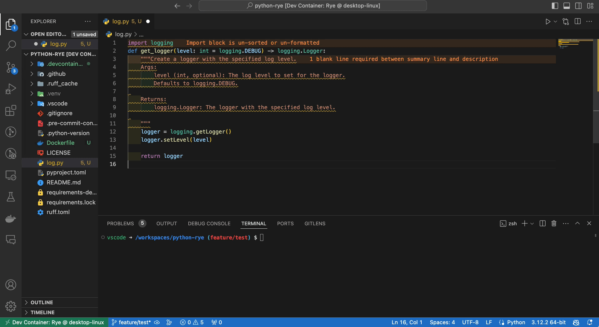

# Welcome to python-uv

## What is python-uv?
This repository contains configurations to set up a Python development environment using VSCode's Dev Container feature.
The environment includes uv and Ruff.

## Project layout
    .
    ├── .devcontainer/
    │   ├── devcontainer.json
    │   └── Dockerfile
    ├── .github/
    │   ├── actions/
    │   │   ├── setup-git-config
    │   │   │   └── action.yml
    │   │   └── setup-python-with-uv
    │   │       └── action.yml
    │   ├── workflows/
    │   │   ├── docker.yml
    │   │   ├── pyright.yml
    │   │   ├── ruff.yml
    │   │   └── test.yml
    │   └── dependabot.yml
    ├── .vscode
    │   ├── extensions.json
    │   └── settings.json
    ├── tests/
    │   └── tools/
    │        ├── test__config.py
    │        ├── test__logger.py
    │        └── test__tracer.py
    ├── tools/
    │   ├── config/
    │   │    ├── __init__.py
    │   │    ├── fastapi.py
    │   │    └── settings.py
    │   ├── logger/
    │   │    ├── __init__.py
    │   │    ├── color.py
    │   │    ├── googlecloud.py
    │   │    ├── local.py
    │   │    ├── logger.py
    │   │    ├── style.py
    │   │    └── type.py
    │   ├── tracer/
    │   │    ├── __init__.py
    │   │    └── timer.py
    │   └── __init__.py
    ├── .dockerignore
    ├── .env.local
    ├── .gitignore
    ├── .pre-commit-config.yaml
    ├── .python-version
    ├── Dockerfile
    ├── pyproject.toml
    ├── pyrightconfig.json
    ├── pytest.ini
    ├── README.md
    ├── ruff.toml
    └── uv.lock
