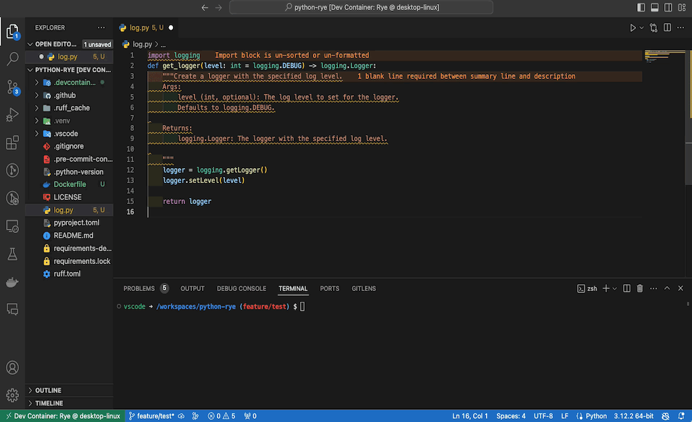

# Welcome to python-uv

A production-ready Python development environment template featuring **uv** for blazing-fast package management, **Ruff** for lightning-fast linting and formatting, and **VSCode Dev Containers** for reproducible development environments.

<div align="center">

</div>

## Overview

This repository provides a complete, batteries-included development environment for modern Python projects. Whether you're building web applications, data science pipelines, or microservices, this template gives you a solid foundation with best practices built-in.

### What's Included

- **Ultra-fast package management** - [uv](https://github.com/astral-sh/uv) is 10-100x faster than pip
- **Lightning-fast code quality** - [Ruff](https://github.com/astral-sh/ruff) replaces Black, isort, Flake8, and more
- **SQL linting** - [sqruff](https://github.com/quarylabs/sqruff) for SQL code quality
- **GitHub Actions linting** - [actionlint](https://github.com/rhysd/actionlint) for workflow file quality
- **Type safety** - ty for comprehensive type checking
- **Automated testing** - pytest with 75% coverage requirement
- **Task automation** - nox for streamlined development workflows
- **Pre-commit hooks** - Automatic code quality checks before every commit
- **CI/CD ready** - GitHub Actions workflows included
- **Production utilities** - Logger, configuration management, and performance tracing

### Key Features

**🚀 Performance First**

- uv resolves dependencies and installs packages 10-100x faster than traditional tools
- Ruff lints and formats Python code orders of magnitude faster than legacy tools
- Optimized Docker images for fast container builds

**🔧 Developer Experience**

- Dev Container configuration for consistent environments across teams
- Pre-configured VSCode settings and extensions
- Automated code formatting on save
- Comprehensive pre-commit hooks

**📦 Production Ready**

- Reusable utility modules for common tasks
- Structured logging with local and Google Cloud support
- Environment-based configuration management
- Performance monitoring with Timer decorator

**✅ Quality Assurance**

- Automated testing with pytest
- Code coverage tracking (75% minimum)
- Type checking with ty
- Continuous integration workflows

## Quick Navigation

### Getting Started

New to this template? Start here:

- [Installation Prerequisites](getting-started/index.md) - Set up Docker, VSCode, and Dev Containers
- [Docker Setup](getting-started/docker.md) - Install Docker Desktop
- [VSCode Setup](getting-started/vscode.md) - Configure your editor
- [Dev Container](getting-started/devcontainer.md) - Launch the development environment

### Development Guides

Learn how to use the tools and utilities:

- [uv Guide](guides/uv.md) - Package management commands
- [Ruff Guide](guides/ruff.md) - Linting and formatting
- [ty Guide](guides/ty.md) - Type checking
- [Testing Guide](guides/test.md) - Running tests with pytest
- [Pre-commit Guide](guides/pre-commit.md) - Automated quality checks
- [Built-in Utilities](guides/tools/index.md) - Logger, Config, Timer

### Configuration Reference

Deep dive into tool configurations:

- [uv Configuration](configurations/uv.md) - Package manager settings
- [Ruff Configuration](configurations/ruff.md) - Linter and formatter rules
- [ty Configuration](configurations/ty.md) - Type checker settings
- [pytest Configuration](configurations/test.md) - Testing framework setup
- [Pre-commit Configuration](configurations/pre-commit.md) - Hook definitions

### Use Cases

See practical examples:

- [Jupyter Notebooks](usecases/jupyter.md) - Data science and exploration
- [FastAPI](usecases/fastapi.md) - Web API development
- [OpenCV](usecases/opencv.md) - Computer vision projects

## Project Structure

```
.
├── tools/                    # Reusable utility modules
│   ├── config/              # Configuration management
│   ├── logger/              # Logging utilities
│   └── tracer/              # Performance monitoring
├── tests/                   # Test suite
├── docs/                    # This documentation
├── .devcontainer/           # Dev Container configuration
├── .github/                 # GitHub Actions workflows
├── noxfile.py              # Task automation
├── pyproject.toml          # Project metadata
├── ruff.toml               # Ruff configuration
├── ty.toml                 # Type checking config
└── pytest.ini              # Testing configuration
```

## Common Commands

```bash
# Install dependencies
uv sync

# Format Python code
uv run nox -s fmt -- --ruff

# Format SQL code
uv run nox -s fmt -- --sqruff

# Run linters
uv run nox -s lint -- --ruff --sqruff --ty

# Run tests
uv run nox -s test

# Serve documentation
uv run mkdocs serve

# Add dependencies
uv add requests pandas
```

## Next Steps

1. **Set up your environment**: Follow the [Getting Started](getting-started/index.md) guide
2. **Explore the utilities**: Check out the [built-in tools](guides/tools/index.md)
3. **Customize for your project**: Review the [configuration guides](configurations/index.md)
4. **See it in action**: Browse the [use cases](usecases/index.md)

## Resources

- [GitHub Repository](https://github.com/a5chin/python-uv)
- [uv Documentation](https://docs.astral.sh/uv)
- [Ruff Documentation](https://docs.astral.sh/ruff)
- [ty Documentation](https://github.com/astral-sh/ty)
